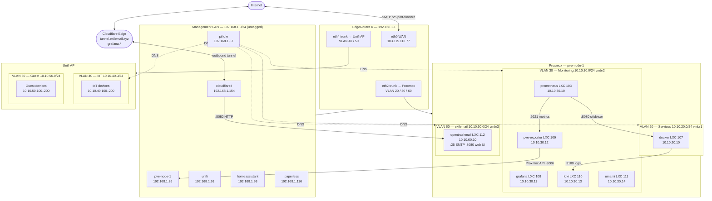

# Network Diagram

---

## VLAN reference

| VLAN | Name | Subnet | Gateway | Trunk port | Firewall |
|------|------|--------|---------|------------|----------|
| untagged | Management | 192.168.1.0/24 | 192.168.1.1 | all | none |
| 10 | Isolated | 192.168.10.0/24 | 192.168.10.1 | — | `IOT_IN` |
| 20 | Services | 10.10.20.0/24 | 10.10.20.1 | eth2 | `BLOCK_IN` |
| 30 | Monitoring | 10.10.30.0/24 | 10.10.30.1 | eth2 | `BLOCK_IN` |
| 40 | IoT | 10.10.40.0/24 | 10.10.40.1 | eth4 | `IOT_IN` |
| 50 | Guest | 10.10.50.0/24 | 10.10.50.1 | eth4 | `BLOCK_IN` |
| 60 | exilemail | 10.10.60.0/24 | 10.10.60.1 | eth2 | `BLOCK_IN` |

## Host reference

| Host | VLAN | IP | VMID | Role |
|------|------|----|------|------|
| pve-node-1 | Management | 192.168.1.85 | — | Proxmox hypervisor |
| pihole | Management | 192.168.1.87 | 100 | DNS / ad blocking |
| unifi | Management | 192.168.1.91 | 101 | Unifi controller |
| homeassistant | Management | 192.168.1.93 | 102 | Home automation |
| paperless | Management | 192.168.1.116 | 104 | Document management |
| cloudflared | Management | 192.168.1.154 | 106 | Cloudflare tunnel daemon |
| docker | VLAN 20 | 10.10.20.10 | 107 | Docker app host |
| prometheus | VLAN 30 | 10.10.30.10 | 103 | Metrics scraping |
| grafana | VLAN 30 | 10.10.30.11 | 108 | Metrics dashboards |
| pve-exporter | VLAN 30 | 10.10.30.12 | 109 | Proxmox → Prometheus bridge |
| loki | VLAN 30 | 10.10.30.13 | 110 | Log aggregation |
| umami | VLAN 30 | 10.10.30.14 | 111 | Web analytics |
| opentrashmail | VLAN 60 | 10.10.60.10 | 112 | Disposable email (exilemail.xyz) |

## Cross-VLAN firewall exceptions

Configured in `BLOCK_IN` on the EdgeRouter. All other cross-VLAN new connections are dropped.

| Rule | Source | Destination | Port | Purpose |
|------|--------|-------------|------|---------|
| 3 | 10.10.30.0/24 | 192.168.1.85 | 8006 | Prometheus → Proxmox API |
| 4 | 10.10.30.0/24 | 10.10.20.10 | 8080 | Prometheus → cAdvisor |
| 5 | 10.10.20.0/24 | 10.10.30.13 | 3100 | Docker LXC → Loki |
